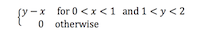

```{r, message=FALSE, warning=FALSE}
library(ggplot2)
library(dplyr)
```
1. Suppose that X is a discrete random variable having probability function $Pr(X = k) = ck^2$ for $k = 1,2,3$. Find $c, Pr(X ≤ 2), E[X]$, and $Var(X).$   

$$ Pr(X=1) + Pr(X=2) + Pr(X=3) = 1$$   
$$ 1^2c + 2^2c + 3^2c =1 $$   
$$ 1c + 4c + 9c = 1$$   
$$ 14c = 1 $$   
$$ c = 1/14 $$

```{r}
# c = 1/14 therefore:
PrX1 <- (1/14)*(1^2)
PrX1
PrX2 <- (1/14)*(2^2)
PrX2
PrX3 <- (1/14)*(3^2)
PrX3

# Pr(X ≤ 2)
PrX1 + PrX2

#Expected value
E_X <- PrX1 + (PrX2 * 2) + (PrX3 * 3)
E_X

# Var(X) = E[X^2] - (E[X])^2
var1 <- PrX1 + (PrX2 * 2^2) + (PrX3 * 3^2)
var2 <- (PrX1 + (PrX2 * 2) + (PrX3 * 3))^2
var1 - var2 
```

2. Suppose that $X$ is a continuous random variable having p.d.f. $f(x) = cx^2$ for $1 ≤ x ≤ 2$. Find $c, Pr(X ≥ 1), E[X],$ and $Var(X)$.     
   
$$ \int_ {1}^{2} cx^2 = 1 = \frac{1}{3}cx^3$$
$$ \frac{1}{3}c(2)^3 - \frac{1c(1)^3}{3} = 1$$
$$ \frac{8c}{3} - \frac{c}{3}$$
$$ c = \frac{3}{7}$$ 
   
Given this range, $Pr(x ≥ 1) = 1$
```{r}
# Expected value
# f(x) = cx^2
# E(X) = Integral of xf(x)dx over the whole domain of X.

f <- function(x){
     (3/7)*x^2
}

f2 <- function(x){x*f(x)}

integrate(f2,1,2)

# Var(X) = E[X^2] - (E[X])^2
f <- function(x){
     (3/7)*x^4
}
f3 <- function(x){x*f(x)}

integrate(f3,1,2)

(4.5) - ((1.6)^2)
```
3. Suppose that $X$ and $Y$ are jointly continuous random variables with:   



a. Compute and plot $f_x(x)$ and $f_y(y)$  
```{r}
x_y <- seq(from = 0, to = 1, by = 0.01)
y_x <- seq(from = 1, to = 2, by = 0.01)
x <- y_x - (1/2)
y <- (3/2) - x_y 

# create a dataframe for the variables
J_randvar <- as.data.frame(cbind(x_y, x, y_x, y)) 

ggplot(J_randvar) + geom_line(aes(x=x, y=x_y), colour="blue") + geom_line(aes(x=y_x, y=y), colour = "red")
```
   
b. Are X and Y independent?      
X and Y are not independent.  
c. Compute $F_X(x)$ and $F_Y(y)$     
$$ F_X(x) = \int f_X(x)dx = \int \frac{1}{2}y^2-xydx = \int \frac{1}{2}y^2dx - \int xydx = \frac{1}{2}xy^2 - \frac{x^2y}{2}$$   
$$ F_Y(y) = \int f_Y(y)dy = \int xy - \frac{1}{2}x^2dy = \int xydy - \int \frac{1}{2}x^2dy = \frac{xy^2}{2}-\frac{1}{2}yx^2$$
d. Compute $E[X], Var(X), E[Y], Var(Y), Cov(X,Y),$ and $Corr(X,Y)$.      
    ...
      
4. Suppose that the following 10 observations come from some distribution (not highly skewed) with unknown mean μ.   
7.3, 6.1, 3.8, 8.4, 6.9, 7.1, 5.3, 8.2, 4.9, 5.8     
Compute $𝑋̅, S2$, and an approximate 95% confidence interval for μ.
```{r}
obs <- c(7.3, 6.1, 3.8, 8.4, 6.9, 7.1, 5.3, 8.2, 4.9, 5.8)
(X_ <- mean(obs))
(S2 <- cov(obs, obs)) #?cov = compute the variance of x and the covariance or correlation of x and y
t.test(obs) # 95 percent confidence interval: 5.328212 7.431788
```
   
5. A random variable X has the memoryless property if, for all $s,t > 0$,
$Pr(𝑋 > 𝑡 + 𝑠|𝑋 > 𝑡) = Pr(𝑋 > 𝑠)$
Show that the exponential distribution has the memoryless property.   
pg. 193 DES - memoryless property:   
for all s ≥ 0 and t ≥ 0:    
$$ P(X > s + t | X > s) = \frac{P(X > s + t)}{P(X > s)}$$   
$$P(X > s + t | X > s) = \frac{e^{-\lambda(s+t)}}{e^{-\lambda s}} = e^{-\lambda t}$$
$$ = P(X>t) $$

6. Suppose $X1,X2,...,Xn$ are i.i.d. $Exp(λ=1)$. Use the Central Limit Theorem to find the
approximate value of $Pr(100 ≤ ∑100 𝑋 ≤ 110). 𝑖=1 𝑖$ 
```{r}
# CLT - given certain conditions, the mean of a sufficiently large number of iterates of independent random variables, each with a well-defined (finite) expected value and finite variance, will be approximately normally distributed, regardless of the underlying distribution.
# Show prob of a normal distribution with mean= 100 and var= 100 between 100 and 110.
set.seed(250)
prob6_110 <- pnorm(110, mean = 100, sd = 10, lower.tail = TRUE)
prob6_100 <- pnorm(100, mean = 100, sd = 10, lower.tail = TRUE)
(prob6_110 - prob6_100)
```
   
5.13    
A random variable $X$ that has a pmf given by $p(x) = 1/(n+1)$ over the range $R_X = {0,1,2,...n}$ is said to have a discrete uniform distribution.   
a. Find the mean and variance of this distribution  
$$E[X] = (\frac{n(n+1)}{2})(\frac{1}{(n+1)})= \frac{n}{2}$$ 
$$Var[x] = E[X^2] - E[X]^2 $$
$$ Var[x] = (\frac{n(n+1)(2n+1)}{6})(\frac{1}{(n+1)}) - (\frac{n}{2})^2$$
$$...$$
$$ = \frac{n(n+2)}{12} $$   
   
b. If $R_X = (a,a+1,a+2,...,b),$ compute the mean and variance of X.   
    ...
  
5.14    
integral of pdf = $-e^{(-0.4x)}$   
```{r}
sat_pdf <- function(years){return(-exp(-0.4 * years))}
# 5 year prob
(P_yr.5 <-  1 - (sat_pdf(5) - sat_pdf(0)))
# 3-6 year prob
(P_yr.3.6 <- sat_pdf(6) - sat_pdf(3))
```
5.39    
a. What is the distribution of the length of the linkage?   
```{r}
link_len <- function(){
  l <- rnorm(1, 60, sqrt(0.09)) + rnorm(1, 40, sqrt(0.05)) + rnorm(1, 50, sqrt(0.11))
  return(l)
}
# simulate 3000 
set.seed(200)
sim_link_len <- replicate(3000, link_len())
# summarize the simulation results
summary(sim_link_len)
# show variance
var(sim_link_len)
```
b. What is the probability that the linkage will be longer than 150.2 cm?   
```{r}
set.seed(200)
(1 - pnorm(150.2, mean = 150, sd = sqrt(0.25)))
```
c. The tolerance limites for the assembly are (149.83, 150.21). What proportion of assemblies are within the tolerance limits?
```{r}
set.seed(200)
pnorm(150.21, mean = 150, sd = sqrt(0.25)) - pnorm(149.83, mean = 150, sd = sqrt(0.25))
```